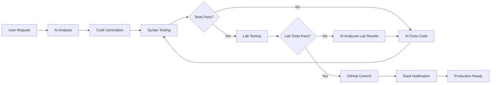

# 🤖 **AI-Powered Network Automation with N8N + NornFlow NetOps**

## **🎯 Complete Workflow Overview**

This guide explains how to use N8N with NornFlow NetOps to create intelligent, AI-driven network automation workflows that automatically generate, test, and deploy network automation scripts.

## **🏗️ System Architecture**

```
┌─────────────────────────────────────────────────────────────────┐
│                    User Interface (N8N Form)                   │
├─────────────────────────────────────────────────────────────────┤
│  ┌─────────────────┐  ┌─────────────────┐  ┌─────────────────┐ │
│  │   AI Analysis   │  │   Code Gen      │  │   NornFlow      │ │
│  │   (GPT-4)       │  │   (GPT-4)       │  │   Execution     │ │
│  └─────────────────┘  └─────────────────┘  └─────────────────┘ │
├─────────────────────────────────────────────────────────────────┤
│  ┌─────────────────┐  ┌─────────────────┐  ┌─────────────────┐ │
│  │   LabFlow       │  │   GitHub        │  │   Slack         │ │
│  │   Testing       │  │   Integration   │  │   Notifications │ │
│  └─────────────────┘  └─────────────────┘  └─────────────────┘ │
└─────────────────────────────────────────────────────────────────┘
```

## **📋 Step-by-Step Usage Guide**

### **Step 1: Setup Prerequisites**

#### **1.1 Install and Configure NornFlow NetOps**
```bash
# Clone and setup NornFlow NetOps
git clone https://github.com/chasewoodard93/nornflow-netops.git
cd nornflow-netops

# Install dependencies
pip install -r requirements.txt

# Setup security and scheduling
python enhancements/security/security_setup.py --create-config --setup-all
python enhancements/scheduling/scheduling_setup.py --create-config --setup-all
python enhancements/visualization/visualization_setup.py --setup-dashboard

# Start NornFlow API server
python -m flask --app enhancements.visualization.monitoring_dashboard run --host=0.0.0.0 --port=5000
```

#### **1.2 Setup N8N Environment**
```bash
# Install N8N
npm install -g n8n

# Set environment variables
export N8N_BASIC_AUTH_ACTIVE=true
export N8N_BASIC_AUTH_USER=admin
export N8N_BASIC_AUTH_PASSWORD=your_password
export OPENAI_API_KEY=your_openai_key

# Start N8N
n8n start
```

#### **1.3 Configure Integration Variables**
In N8N, set these environment variables:
```javascript
// N8N Environment Variables
{
  "nornflow_username": "admin",
  "nornflow_password": "your_nornflow_password",
  "github_username": "your_github_username",
  "slack_channel": "#network-automation",
  "labflow_token": "your_labflow_token"
}
```

### **Step 2: Import N8N Workflow**

1. **Import the Workflow**:
   - Copy the content from `n8n_workflows/network_automation_generator.json`
   - In N8N interface, go to **Workflows** → **Import from JSON**
   - Paste the JSON content and save

2. **Configure Credentials**:
   - **OpenAI**: Add your OpenAI API key for GPT-4 access
   - **GitHub**: Setup OAuth2 for repository creation
   - **Slack**: Configure webhook or OAuth for notifications
   - **NornFlow**: Setup HTTP authentication for API access

### **Step 3: Using the AI Automation Generator**

#### **3.1 Access the Form**
1. In N8N, activate the "AI Network Automation Generator" workflow
2. Access the form at: `http://your-n8n-instance/form/automation-generator`

#### **3.2 Fill Out Project Requirements**

**Basic Information:**
- **Project Name**: `cisco-backup-automation`
- **Task Type**: `Configuration Backup`
- **Device Types**: `Cisco IOS/IOS-XE`, `Cisco NX-OS`

**Environment Setup:**
- **Inventory Source**: `NetBox IPAM`
- **Authentication**: `Username/Password`
- **Secrets Management**: `HashiCorp Vault`

**Variables (YAML format):**
```yaml
backup_location: "/backups/configs"
retention_days: 30
backup_format: "text"
include_startup: true
include_running: true
notification_email: "netops@company.com"
```

**Special Requirements:**
```
- Backup configurations from all Cisco devices
- Store backups with timestamp and device hostname
- Validate backup completeness
- Send email notification on completion
- Handle authentication failures gracefully
```

**Testing Environment**: `ContainerLab Virtual Devices`

#### **3.3 Submit and Monitor**

1. **Submit the Form**: Click submit to trigger the AI workflow
2. **Monitor Progress**: Watch the N8N execution log for real-time progress
3. **Review AI Analysis**: The AI will analyze requirements and create a detailed plan

### **Step 4: AI Workflow Execution**

#### **4.1 AI Analysis Phase**
The AI analyzes your requirements and generates:
```json
{
  "workflow_design": {
    "main_tasks": [
      "connect_to_devices",
      "backup_configurations", 
      "validate_backups",
      "store_backups",
      "send_notifications"
    ],
    "error_handling": "comprehensive",
    "retry_logic": "enabled"
  },
  "required_plugins": [
    "nornir_netmiko",
    "nornir_napalm", 
    "nornir_utils"
  ],
  "python_dependencies": [
    "nornir>=3.3.0",
    "netmiko>=4.1.0",
    "napalm>=4.0.0"
  ]
}
```

#### **4.2 Code Generation Phase**
The AI generates complete Python code:

**Generated Files:**
- `main.py` - Main Nornir workflow script
- `inventory/hosts.yaml` - Device inventory
- `inventory/groups.yaml` - Device groups
- `inventory/defaults.yaml` - Default settings
- `tasks/backup_task.py` - Custom backup task
- `templates/backup_report.j2` - Report template
- `requirements.txt` - Python dependencies
- `README.md` - Usage instructions

**Example Generated Code:**
```python
# main.py (AI-generated)
from nornir import InitNornir
from nornir_netmiko import netmiko_send_command
from nornir_utils.plugins.functions import print_result
import logging
from datetime import datetime
from pathlib import Path

def backup_configuration(task):
    """Backup device configuration with error handling."""
    try:
        # Get running configuration
        running_config = task.run(
            netmiko_send_command,
            command_string="show running-config",
            name="Get Running Config"
        )
        
        # Create backup directory
        backup_dir = Path(f"/backups/{task.host.name}")
        backup_dir.mkdir(parents=True, exist_ok=True)
        
        # Save configuration with timestamp
        timestamp = datetime.now().strftime("%Y%m%d_%H%M%S")
        backup_file = backup_dir / f"running_config_{timestamp}.txt"
        
        with open(backup_file, 'w') as f:
            f.write(running_config.result)
        
        return f"Backup saved: {backup_file}"
        
    except Exception as e:
        return f"Backup failed: {str(e)}"

def main():
    """Main workflow execution."""
    # Initialize Nornir
    nr = InitNornir(config_file="config.yaml")
    
    # Run backup task
    result = nr.run(task=backup_configuration)
    
    # Print results
    print_result(result)

if __name__ == "__main__":
    main()
```

### **Step 5: Automated Testing & Iteration**

#### **5.1 Initial Testing**
NornFlow automatically tests the generated code:
- **Syntax Validation**: Checks Python syntax
- **Import Validation**: Verifies all imports are available
- **Workflow Structure**: Validates Nornir workflow format

#### **5.2 AI-Driven Improvement**
If tests fail, the AI automatically:
1. **Analyzes Errors**: Reviews test results and error messages
2. **Identifies Issues**: Determines root causes
3. **Fixes Code**: Generates improved code
4. **Retests**: Runs tests again until they pass

#### **5.3 Lab Environment Testing**
Once basic tests pass, LabFlow:
1. **Creates Test Environment**: Spins up ContainerLab devices
2. **Deploys Code**: Installs the workflow in the test environment
3. **Runs Comprehensive Tests**: Tests against real (virtual) devices
4. **Validates Results**: Ensures the workflow works as expected

### **Step 6: Production Deployment**

#### **6.1 GitHub Integration**
When all tests pass:
1. **Repository Creation**: Creates a new GitHub repository
2. **Code Commit**: Commits all generated files
3. **Documentation**: Includes comprehensive README and documentation

#### **6.2 Slack Notifications**
Receive detailed notifications:
```
🎉 Network Automation Workflow Created Successfully!

Project: cisco-backup-automation
Task Type: Configuration Backup
Device Types: Cisco IOS/IOS-XE, Cisco NX-OS

✅ Status: All tests passed
🔗 Repository: https://github.com/username/cisco-backup-automation
🧪 Lab Results: 5/5 tests passed

Next Steps:
• Review the generated code
• Deploy to production when ready
• Monitor execution results

Generated by: AI Network Automation Generator
```

## **🔄 Iterative Development Process**

### **Continuous Improvement Loop**


### **Learning from Failures**
The AI system learns from each iteration:
- **Error Patterns**: Recognizes common error patterns
- **Device-Specific Issues**: Learns device-specific quirks
- **Best Practices**: Incorporates successful patterns
- **Performance Optimization**: Improves code efficiency

## **🎯 Advanced Use Cases**

### **1. Complex Multi-Vendor Automation**
```yaml
# Advanced project example
project_name: "multi-vendor-compliance-check"
task_type: "Compliance Checking"
device_types: 
  - "Cisco IOS/IOS-XE"
  - "Juniper JunOS"
  - "Arista EOS"
  - "Palo Alto PAN-OS"

special_requirements: |
  - Check compliance against company security policies
  - Generate detailed compliance reports
  - Handle different CLI syntaxes for each vendor
  - Implement parallel execution for performance
  - Include remediation suggestions for non-compliant items
```

### **2. Automated Firmware Upgrades**
```yaml
project_name: "automated-firmware-upgrade"
task_type: "Firmware Upgrade"
device_types: ["Cisco IOS/IOS-XE"]

variables:
  firmware_version: "16.12.08"
  upgrade_window: "02:00-06:00"
  rollback_enabled: true
  pre_upgrade_backup: true
  post_upgrade_validation: true

special_requirements: |
  - Perform pre-upgrade health checks
  - Backup configurations before upgrade
  - Validate firmware compatibility
  - Monitor upgrade progress
  - Automatic rollback on failure
  - Post-upgrade validation tests
```

### **3. Network Discovery and Documentation**
```yaml
project_name: "network-discovery-automation"
task_type: "Network Discovery"
device_types: ["Mixed Environment"]

special_requirements: |
  - Discover all network devices in specified subnets
  - Identify device types, models, and software versions
  - Map network topology and connections
  - Generate network documentation
  - Update NetBox IPAM with discovered devices
  - Create Visio-compatible topology diagrams
```

## **🚀 Benefits of This Approach**

### **1. Rapid Development**
- **Minutes vs Hours**: Generate complex workflows in minutes instead of hours
- **AI Expertise**: Leverage AI knowledge of best practices
- **Automated Testing**: Comprehensive testing without manual effort

### **2. Quality Assurance**
- **Multiple Test Layers**: Syntax, imports, workflow, lab testing
- **Real Device Testing**: Validation against actual network devices
- **Iterative Improvement**: Automatic code improvement until tests pass

### **3. Knowledge Sharing**
- **Standardized Code**: Consistent coding patterns and best practices
- **Documentation**: Automatic generation of comprehensive documentation
- **Version Control**: All code stored in GitHub with proper versioning

### **4. Risk Mitigation**
- **Safe Testing**: Isolated lab environments prevent production issues
- **Rollback Capabilities**: Easy rollback if issues are discovered
- **Comprehensive Validation**: Multiple validation layers ensure reliability

This AI-powered approach transforms network automation from a manual, error-prone process into an intelligent, automated pipeline that generates, tests, and deploys production-ready network automation workflows! 🤖🚀
