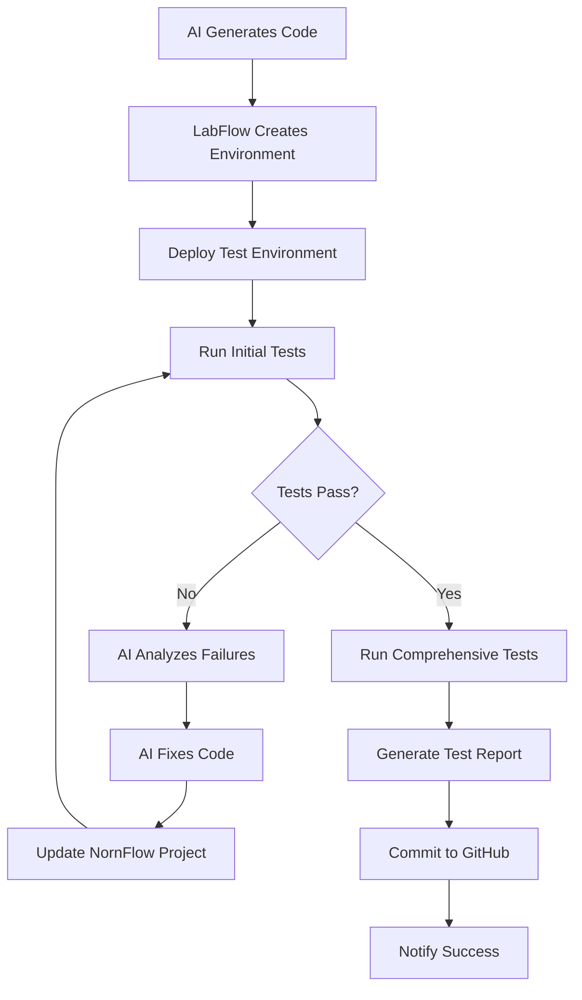

# 🧪 **LabFlow Integration Specification**

## **Overview**

LabFlow is the companion tool for automated lab environment creation and testing. It integrates with NornFlow NetOps to provide comprehensive testing environments for AI-generated network automation workflows.

## **🏗️ LabFlow Architecture**

```
┌─────────────────────────────────────────────────────────────────┐
│                        LabFlow Core                             │
├─────────────────────────────────────────────────────────────────┤
│  ┌─────────────────┐  ┌─────────────────┐  ┌─────────────────┐ │
│  │  Environment    │  │   Topology      │  │   Resource      │ │
│  │   Manager       │  │   Builder       │  │   Manager       │ │
│  └─────────────────┘  └─────────────────┘  └─────────────────┘ │
├─────────────────────────────────────────────────────────────────┤
│  ┌─────────────────┐  ┌─────────────────┐  ┌─────────────────┐ │
│  │  ContainerLab   │  │   Terraform     │  │   Test Runner   │ │
│  │   Integration   │  │   Integration   │  │   Framework     │ │
│  └─────────────────┘  └─────────────────┘  └─────────────────┘ │
└─────────────────────────────────────────────────────────────────┘
```

## **🔧 Core Features**

### **1. Environment Management**
- **Multi-Platform Support**: ContainerLab, Azure, AWS, VMware
- **Topology Templates**: Pre-built network topologies for common scenarios
- **Resource Allocation**: CPU, memory, storage management
- **Lifecycle Management**: Create, snapshot, restore, destroy environments

### **2. ContainerLab Integration**
```yaml
# Example ContainerLab topology for Cisco testing
name: cisco-test-lab
topology:
  nodes:
    router1:
      kind: cisco_iosxe
      image: cisco/iosxe:latest
      mgmt_ipv4: 172.20.20.10
    router2:
      kind: cisco_iosxe
      image: cisco/iosxe:latest
      mgmt_ipv4: 172.20.20.11
    switch1:
      kind: cisco_iosxe
      image: cisco/iosxe-switch:latest
      mgmt_ipv4: 172.20.20.12
  
  links:
    - endpoints: ["router1:eth1", "router2:eth1"]
    - endpoints: ["router1:eth2", "switch1:eth1"]
    - endpoints: ["router2:eth2", "switch1:eth2"]
```

### **3. Cloud Integration (Terraform)**
```hcl
# Azure lab environment
resource "azurerm_resource_group" "lab" {
  name     = "nornflow-lab-${var.project_id}"
  location = var.location
}

resource "azurerm_virtual_network" "lab_vnet" {
  name                = "lab-vnet"
  address_space       = ["10.0.0.0/16"]
  location            = azurerm_resource_group.lab.location
  resource_group_name = azurerm_resource_group.lab.name
}

resource "azurerm_linux_virtual_machine" "network_device" {
  count               = var.device_count
  name                = "device-${count.index + 1}"
  resource_group_name = azurerm_resource_group.lab.name
  location            = azurerm_resource_group.lab.location
  size                = "Standard_B2s"
  
  # Network device configuration
  custom_data = base64encode(templatefile("${path.module}/device-config.sh", {
    device_type = var.device_types[count.index]
    mgmt_ip     = "10.0.1.${count.index + 10}"
  }))
}
```

## **🔗 N8N Integration Points**

### **API Endpoints**

#### **1. Environment Creation**
```http
POST /api/environments/create
Content-Type: application/json

{
  "environment_type": "ContainerLab Virtual Devices",
  "device_types": ["Cisco IOS/IOS-XE", "Juniper JunOS"],
  "topology_requirements": {
    "devices": 3,
    "links": ["router-router", "router-switch"],
    "management_network": "172.20.20.0/24"
  },
  "project_id": "uuid-from-nornflow",
  "duration_hours": 4
}
```

**Response:**
```json
{
  "success": true,
  "environment_id": "lab-env-12345",
  "management_ips": {
    "router1": "172.20.20.10",
    "router2": "172.20.20.11",
    "switch1": "172.20.20.12"
  },
  "access_info": {
    "ssh_key": "/tmp/lab-key.pem",
    "username": "admin",
    "password": "generated-password"
  },
  "estimated_ready_time": "2024-01-15T10:05:00Z"
}
```

#### **2. Test Execution**
```http
POST /api/testing/run
Content-Type: application/json

{
  "environment_id": "lab-env-12345",
  "workflow_code": {
    "main.py": "# Nornir workflow code",
    "inventory/hosts.yaml": "# Device inventory",
    "requirements.txt": "# Python dependencies"
  },
  "test_scenarios": [
    {
      "name": "Basic Connectivity",
      "type": "ping_test",
      "targets": ["all"]
    },
    {
      "name": "Configuration Backup",
      "type": "workflow_execution",
      "workflow": "backup_configs"
    }
  ]
}
```

**Response:**
```json
{
  "success": true,
  "test_id": "test-run-67890",
  "results": {
    "overall_status": "passed",
    "test_summary": "3/3 tests passed",
    "detailed_results": {
      "Basic Connectivity": {
        "status": "passed",
        "duration": "15s",
        "details": "All devices reachable"
      },
      "Configuration Backup": {
        "status": "passed",
        "duration": "45s",
        "details": "Backed up 3 device configurations"
      }
    }
  },
  "artifacts": {
    "logs": "/tmp/test-logs-67890.txt",
    "configs": "/tmp/backup-configs-67890.tar.gz",
    "reports": "/tmp/test-report-67890.html"
  }
}
```

## **🤖 AI-Driven Testing Workflow**

### **Intelligent Test Generation**
```python
# LabFlow AI Test Generator
class AITestGenerator:
    def generate_tests(self, workflow_code, device_types):
        """Generate comprehensive test scenarios based on workflow analysis."""
        
        # Analyze workflow to understand what it does
        workflow_analysis = self.analyze_workflow(workflow_code)
        
        # Generate appropriate test scenarios
        test_scenarios = []
        
        if 'backup' in workflow_analysis['actions']:
            test_scenarios.append({
                'name': 'Configuration Backup Validation',
                'type': 'backup_test',
                'validation': [
                    'check_backup_files_created',
                    'validate_backup_content',
                    'verify_backup_completeness'
                ]
            })
        
        if 'configuration' in workflow_analysis['actions']:
            test_scenarios.append({
                'name': 'Configuration Deployment Test',
                'type': 'config_test',
                'validation': [
                    'pre_deployment_snapshot',
                    'deploy_configuration',
                    'validate_configuration',
                    'rollback_test'
                ]
            })
        
        return test_scenarios
```

### **Iterative Testing Process**


## **🔧 Implementation Example**

### **N8N Node: Create Lab Environment**
```javascript
// N8N Custom Node for LabFlow Integration
{
  "name": "LabFlow Environment",
  "type": "labflow-environment",
  "parameters": {
    "operation": "create",
    "environment_type": "{{ $json.testing_environment }}",
    "device_types": "{{ $json.target_device_types }}",
    "topology": {
      "auto_generate": true,
      "device_count": "{{ $json.device_types.length }}",
      "management_network": "172.20.20.0/24"
    },
    "duration_hours": 2,
    "auto_cleanup": true
  }
}
```

### **Test Execution Node**
```javascript
{
  "name": "Run Lab Tests",
  "type": "labflow-testing",
  "parameters": {
    "environment_id": "{{ $('LabFlow Environment').first().json.environment_id }}",
    "test_type": "comprehensive",
    "workflow_files": "{{ $('AI Code Generation').first().json }}",
    "validation_rules": [
      "syntax_check",
      "import_validation",
      "connectivity_test",
      "workflow_execution",
      "result_validation"
    ],
    "retry_on_failure": true,
    "max_retries": 3
  }
}
```

## **🎯 Integration Benefits**

### **1. Automated Testing Pipeline**
- **Zero-Touch Testing**: Fully automated from code generation to validation
- **Comprehensive Coverage**: Syntax, imports, connectivity, functionality
- **Real Device Testing**: Actual network device simulation
- **Iterative Improvement**: AI learns from failures and improves

### **2. Risk Mitigation**
- **Safe Testing Environment**: Isolated lab environments
- **Rollback Capabilities**: Easy environment reset and restoration
- **Failure Analysis**: Detailed failure analysis and recommendations
- **Production Readiness**: Validated code before production deployment

### **3. Scalability**
- **Parallel Testing**: Multiple environments for concurrent testing
- **Resource Optimization**: Efficient resource allocation and cleanup
- **Cloud Integration**: Scalable cloud-based testing environments
- **Cost Management**: Automatic cleanup and resource optimization

## **🚀 Deployment Architecture**

### **Microservices Deployment**
```yaml
# Docker Compose for LabFlow
version: '3.8'
services:
  labflow-api:
    image: labflow:latest
    ports:
      - "5001:5000"
    environment:
      - CONTAINERLAB_PATH=/usr/local/bin/containerlab
      - TERRAFORM_PATH=/usr/local/bin/terraform
      - AZURE_SUBSCRIPTION_ID=${AZURE_SUBSCRIPTION_ID}
    volumes:
      - /var/run/docker.sock:/var/run/docker.sock
      - ./lab-environments:/app/environments
  
  labflow-worker:
    image: labflow-worker:latest
    environment:
      - REDIS_URL=redis://redis:6379
      - CELERY_BROKER=redis://redis:6379
    depends_on:
      - redis
  
  redis:
    image: redis:alpine
    ports:
      - "6379:6379"
```

This LabFlow integration provides the missing piece for comprehensive AI-driven network automation - **automated testing and validation** in realistic environments before production deployment! 🧪🚀
